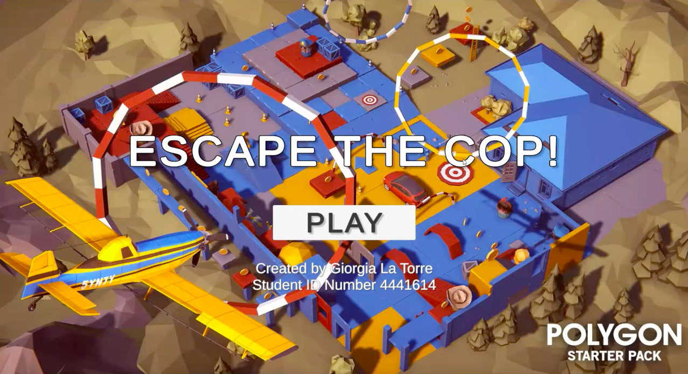
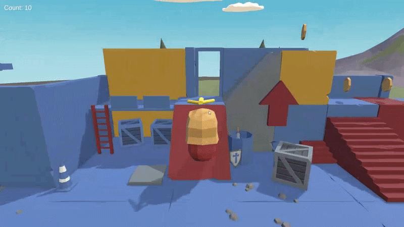

# Escape the Cop!

  

  

A small 3D game built in **Unity** (C#) as part of a university exam project.
The goal: collect all the coins scattered around the level while avoiding a cop that starts
chasing you once the tutorial phase ends.

> Want to play it? Grab the ready-to-run Windows build from the [Releases page](https://github.com/Giorgia9806/Escape-The-Cop-3D-Simulation/releases/tag/v1.0) — no Unity installation needed.

---

## Gameplay

1. The game starts in a **locked** state:
   - Coins are visible but not collectible
   - The enemy is visible but does not move
2. The player gets a short intro hint explaining the controls.
3. Entering a specific trigger zone:
   - Shows a hint message
   - Starts the chase music
4. Exiting that trigger zone:
   - Unlocks gameplay
   - The enemy starts chasing the player
   - Coins become collectible
5. **Win** by collecting all the coins.
   **Lose** if caught by the enemy after gameplay has been unlocked.

## Controls

| Input | Action |
|---|---|
| `W A S D` | Move |
| `Space` | Jump |
| `Arrow Keys` | Rotate / zoom camera |
| `H` | Toggle 3D coin-guide arrow |

Input is handled entirely through Unity's **New Input System**.

---

## Technical Highlights

- **Rigidbody-based movement** with smooth rotation toward the movement direction, mapped to camera-relative space
- **Jump system** with coyote time and jump buffering for more forgiving, responsive platforming
- **NavMeshAgent-driven enemy AI** that periodically re-paths toward the player, validating reachability before committing to a destination
- **Jump pads** that behave differently depending on what enters them: an upward physics impulse for the player's Rigidbody, versus a scripted parabolic arc (with safe NavMesh re-attachment) for the NavMeshAgent enemy
- **Centralized gameplay state** (`GameManager`) that locks/unlocks pickups and enemies without ever hiding them from the scene
- **Persistent singleton AudioManager** handling music transitions and win/lose "ducking" (smooth music fade-out before playing a result SFX)
- Clear separation of concerns: movement, camera, AI, audio, and game-flow logic each live in their own script

---

## Repository Contents

This repository contains the **C# scripts** and documentation for the project. The full Unity
project folder (scenes, prefabs, models, audio, `Assets`/`Packages`/`ProjectSettings`) isn't
included here for file size reasons — but a ready-to-play **Windows build is available in the
[Releases section](https://github.com/Giorgia9806/Escape-The-Cop-3D-Simulation/releases/tag/v1.0)**,
so you can actually run and play the game without needing the source project.

| Script | Responsibility |
|---|---|
| [`PlayerController.cs`](./PlayerController.cs) | Player movement, jump (coyote time + buffer), coin pickup, win/lose logic |
| [`CameraController.cs`](./CameraController.cs) | Third-person orbit camera (manual yaw + zoom, fixed pitch) |
| [`EnemyMovement.cs`](./EnemyMovement.cs) | NavMeshAgent-based chase AI |
| [`GameManager.cs`](./GameManager.cs) | Global lock/unlock state for pickups and enemies |
| [`HintTrigger.cs`](./HintTrigger.cs) | Tutorial trigger: hint UI, chase music, gameplay unlock |
| [`IntroHint.cs`](./IntroHint.cs) | Intro UI hint, auto-hides on first input |
| [`JumpPad.cs`](./JumpPad.cs) | Trampoline trigger for player + enemy (arc launch) |
| [`CoinGuideArrow3D.cs`](./CoinGuideArrow3D.cs) | Toggleable 3D arrow pointing to the nearest coin |
| [`Rotator.cs`](./Rotator.cs) | Simple constant Y-axis rotation (used on pickups) |
| [`AudioManager.cs`](./AudioManager.cs) | Persistent singleton for music/SFX, incl. win/lose ducking |
| [`MenuManager.cs`](./MenuManager.cs) | Main menu: play / quit |
| [`MenuAudioStarter.cs`](./MenuAudioStarter.cs) | Starts menu music on scene load |
| [`RestartGame.cs`](./RestartGame.cs) | Scene reload + time scale reset |

---

## Tech Stack

- **Engine:** Unity (LTS)
- **Language:** C#
- **Input:** Unity New Input System
- **Physics:** Rigidbody-based movement
- **Navigation:** NavMeshAgent

---

## Media

- [Watch the gameplay walkthrough (3 min)](https://youtu.be/BQk8lL8k5kI)
- [Download Windows build (v1.0)](https://github.com/Giorgia9806/Escape-The-Cop-3D-Simulation/releases/tag/v1.0)

---

## Author

Developed by Giorgia Baiardo — university project.
